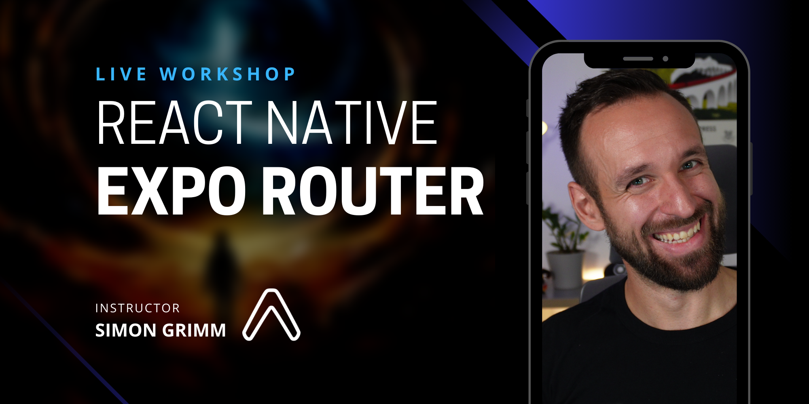

# React Native Expo Router Workshop | [Galaxies.dev](https://galaxies.dev)

**Learn the foundational concepts of Expo Router and how to use it in your React Native app.**
In this workshop, you will learn how to use the Expo Router to build a React Native app with multiple screens. We will cover the basics of the router, how to use it with different layouts, how to pass parameters and how to style your app. We will also cover advanced topics like deep linking and authentication.

## Pre-Workshop Instructions/Requirements

To get the most out of this workshop, please be prepared and do the following upfront:

- [ ] Clone this repository with `git clone https://github.com/Galaxies-dev/expo-router-workshop.git`
- [ ] Run `npm install` in the `src/basic-app` folder
- [ ] Run `npm install` in the `src/base-auth-app` folder
- [ ] Have all [requirements for Expo](https://docs.expo.dev/get-started/installation/) ready (Node, Git, Expo CLI, Expo Go)
- [ ] Make sure you can create a new project with `npx create-expo-app`
- [ ] Have either the iOS simulator or Android emulator installed
- [ ] Be able to run your app on the simulator/emulator with `expo start`

## Workshop Outline

Here are the topics we'll be covering:

- File-based routing
- Stack, Tabs, Drawer
- Navigation parameters
- Expo Router hooks
- Expo Web
- Platform-specific layouts
- CSS
- Deep Linking
- Authentication
- Nested Layouts

## Exercises

This workshop is based on a series of exercises. Each exercise contains files you need to copy in your workshop app project. The exercises are located in the `exercises` folder. The solutions are located in the `src/1-app`, `src/2-app`, `src/final-app` and `src/final-auth-app` folders.

You can also find [all the slides here](https://slides.com/simongrimm-1/expo-router).

### Routing with Expo Router

- `exercises/1-1` - Stack Layout
- `exercises/1-2` - Tabs Layout
- `exercises/1-3` - Drawer Layout
- `exercises/1-4` - Hooks and Navigation
- `exercises/1-5` - Nested Layouts

### Universal Apps with Expo Router

- `exercises/2-1` - Web Layouts
- `exercises/2-2` - Platform-specific Modules
- `exercises/2-3` - CSS
- `exercises/2-4` - Head and Meta
- `exercises/2-5` - Static Site Generation
- `exercises/2-6` - Deep Linking

### Authentication with Expo Router

- `exercises/3-1` - Login & Registration
- `exercises/3-2` - Auth Context
- `exercises/3-3` - Nested Layouts
- `exercises/3-4` - Additional Drawer

## License

This material is available for private, non-commercial use under the [GPL version 3](http://www.gnu.org/licenses/gpl-3.0-standalone.html). If you would like to use this material to conduct your own workshop, please contact me at simon@galaxies.dev